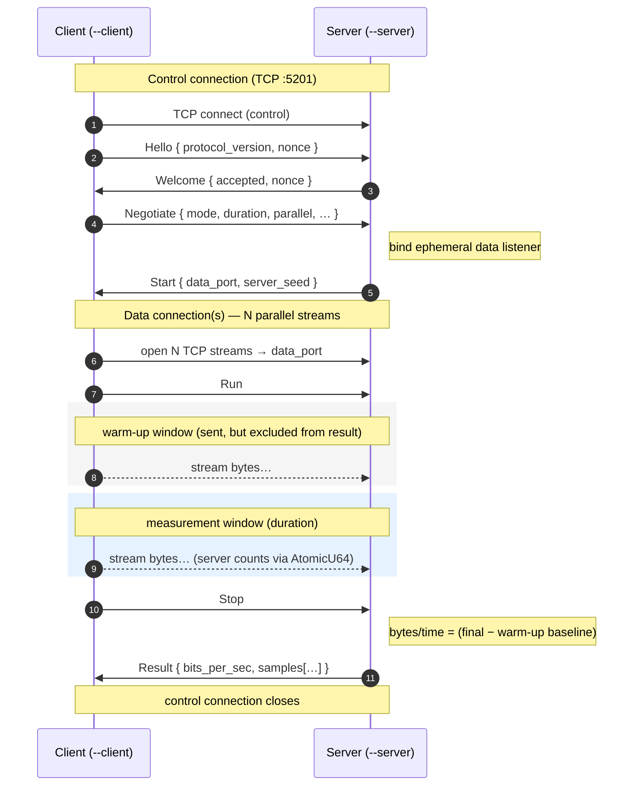
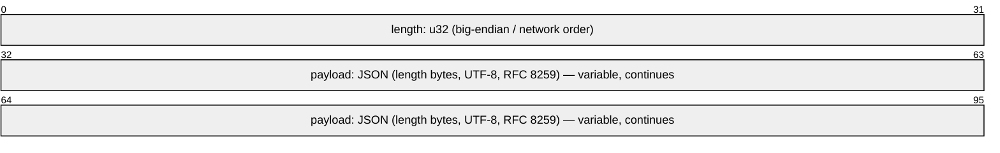
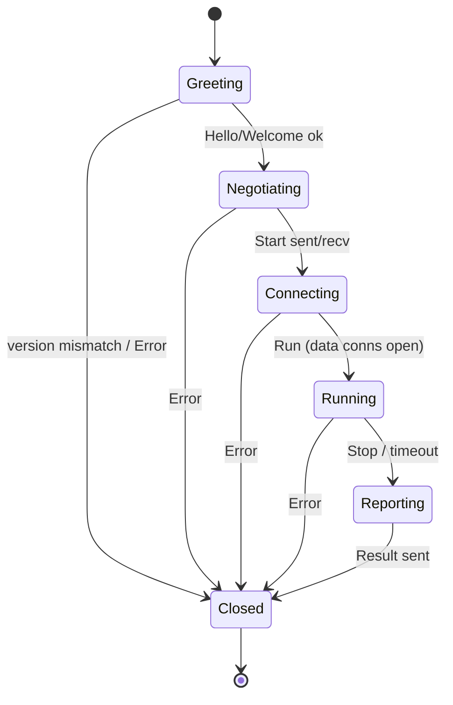

# andri — Control Protocol & Wire Format

**Author:** [mavyfaby](https://github.com/mavyfaby) &lt;maverickfabroa@gmail.com&gt;

> Detailed spec for the control channel. See [DESIGN.md](../DESIGN.md) for the
> architecture overview and the master [References](../DESIGN.md#references) list.
> Status: **draft** — subject to change until v1 is tagged.

The key words **MUST**, **MUST NOT**, **SHOULD**, **SHOULD NOT**, and **MAY** in this
document are to be interpreted as described in **[RFC 2119](https://www.rfc-editor.org/info/rfc2119)**
and **[RFC 8174](https://www.rfc-editor.org/info/rfc8174)** (uppercase only).

> **Scope.** This document specifies the **binary↔binary** path: the `andri` server and
> the thin `andri` client binary. It is *not* the protocol the browser dashboard uses —
> a browser cannot speak this custom framing. The web UI's HTTP/WebSocket protocol is
> specified separately in [docs/web.md](web.md). The two surfaces are independent.

The control protocol coordinates a session: the client and server agree on a mode and
parameters, run the data phase, then exchange results. It runs over a single dedicated
TCP connection ([RFC 9293](https://www.rfc-editor.org/info/rfc9293)), separate from the
data connections it sets up.

## 1. Connection model

The TCP-mode session flow (as implemented). The **control** and **data** connections are
distinct TCP connections; the server's authoritative received-byte `Result` excludes the
warm-up window:



- **Control port** default `5201` (TCP), configurable via `--port`. 5201 sits in the
  User/Registered range (1024–49151) defined by
  **[RFC 6335](https://www.rfc-editor.org/info/rfc6335)**; deployments SHOULD follow the
  assigned-port guidance in **[RFC 7605](https://www.rfc-editor.org/info/rfc7605)**
  (BCP 165) — notably, the data listener uses an ephemeral port chosen by the OS rather
  than a second fixed assignment.
- The client **MUST** initiate the control connection.
- The control connection stays open for the whole session. Closing it at any point
  aborts the session (see §6).
- Data connections are described in the per-mode docs; the control protocol only conveys
  the `data_port` and the agreed parameters.

## 2. Message framing

Control messages are **length-delimited JSON**
([RFC 8259](https://www.rfc-editor.org/info/rfc8259)):



- `length` is the byte count of the JSON payload that follows, encoded **big-endian**
  (network byte order, per **[RFC 791](https://www.rfc-editor.org/info/rfc791)**
  Appendix B). Note this is independent of the **little-endian** stamps inside UDP *data*
  packets — framing and data layout are deliberately separate choices.
- The payload **MUST** be valid UTF-8 JSON per RFC 8259.
- Maximum payload size is **64 KiB** (65536 bytes); a larger declared `length` is a
  protocol error and the receiver **MUST** close the connection. This cap is andri's own
  self-imposed limit — **not** a standard or RFC requirement. The `u32` length prefix
  technically permits up to ~4 GiB; we cap low because JSON control messages are tiny and
  a small ceiling is a cheap abuse guard.
- One frame = one message. Messages are processed in order.

Rationale for JSON now: human-debuggable, interoperable, and trivial to evolve with
optional fields. The framing is serialization-agnostic, so a later move to a binary codec
(see §8) changes only the payload encoding, not the 4-byte length prefix.

## 3. Message types

All messages are a single tagged enum so the wire carries a discriminant:

```rust
#[serde(tag = "type")]
enum Msg {
    Hello(Hello),
    Welcome(Welcome),
    Negotiate(Negotiate),
    Start(Start),
    Run,
    Stop,
    Result(Result),
    Error(ProtoError),
}
```

### 3.1 Hello (client → server)

```rust
struct Hello {
    protocol_version: u16,   // bumped on incompatible wire changes; starts at 1
    client_version: String,  // andri crate version, informational
    nonce: u64,              // echoed in Welcome to bind the session
}
```

The `nonce` **SHOULD** be generated from a cryptographically strong source where session
binding matters, following **[RFC 4086](https://www.rfc-editor.org/info/rfc4086)**
(Randomness Requirements for Security); for a trusted LAN a non-CSPRNG value is
acceptable since the nonce here only correlates Hello/Welcome, not authentication.

### 3.2 Welcome (server → client)

```rust
struct Welcome {
    protocol_version: u16,   // server's version
    server_version: String,
    nonce: u64,              // MUST equal Hello.nonce
    accepted: bool,          // false if versions are incompatible
}
```

If `protocol_version` differs and the two cannot agree, the server **MUST** set
`accepted = false`, follow with an `Error` (`VersionMismatch`), and close.

### 3.3 Negotiate (client → server)

```rust
enum Mode { Tcp, Udp, File }

struct Negotiate {
    mode: Mode,
    duration_secs: u64,      // measurement window, default 10
    warmup_secs: u64,        // excluded from results; default 1 (TCP/UDP), 0 (file)
    parallel: u32,           // data connections, default 1
    buffer_bytes: usize,     // per-stream buffer, default 65536
    bidir: bool,             // send + receive simultaneously
    // UDP only:
    bitrate_bps: Option<u64>,   // target send rate, bits/s
    packet_bytes: Option<usize>,// datagram payload size
    // File only:
    file_len: Option<u64>,      // bytes the client will send
    null_source: Option<bool>,  // stream from memory, skip disk read
}
```

The server validates against its own limits (§5) and either replies `Start` or `Error`
(`InvalidParams`).

### 3.4 Start (server → client)

```rust
struct Start {
    data_port: u16,          // ephemeral; where the client opens data connection(s)
    server_seed: u64,        // optional payload pattern seed, for verification
}
```

After `Start` the server has a data listener bound and is accepting up to `parallel`
connections. The client opens them, then sends `Run`.

### 3.5 Run / Stop (client → server)

`Run` and `Stop` carry no payload. `Run` marks the start of the measurement window on
both ends (server starts its monotonic clock on receipt, client on send — small skew is
acceptable because each side reports its own locally-timed counters). `Stop` is sent by
the client after `duration + warmup`; on receipt the server freezes its counters and
computes `Result`. The server also runs an independent duration timer as a safety net
(§6).

### 3.6 Result (server → client)

```rust
enum Role { Send, Receive }  // direction this result describes; both for bidir

struct Result {
    role: Role,              // which direction this result describes
    bytes: u64,              // measured bytes, excluding warm-up
    duration_secs: f64,      // measured window, excluding warm-up
    bits_per_sec: f64,
    bytes_per_sec: f64,
    // UDP only:
    packets_expected: Option<u64>,
    packets_received: Option<u64>,
    packets_lost: Option<u64>,   // one-way loss, per RFC 7680
    loss_ratio: Option<f64>,
    jitter_ms: Option<f64>,      // interarrival jitter, RFC 3550 §6.4.1
    samples: Vec<Sample>,        // per-second time series (may be empty)
}

struct Sample {
    t_secs: f64,                 // seconds since Run, monotonic
    bytes: u64,                  // bytes in this 1s interval (aggregate)
    bits_per_sec: f64,
    // UDP only:
    packets_lost: Option<u64>,
    jitter_ms: Option<f64>,
}
```

For `bidir`, two `Result` messages are sent (one per direction), each tagged with `role`.
Loss and jitter semantics are defined in the UDP mode doc and trace to
[RFC 7680](https://www.rfc-editor.org/info/rfc7680) (loss) and
[RFC 3550](https://www.rfc-editor.org/info/rfc3550) §6.4.1 (jitter).

### 3.7 Error (either direction)

```rust
enum ProtoError {
    VersionMismatch,
    InvalidParams,
    UnexpectedMessage,   // message out of sequence for current state
    DataConnectFailed,
    Timeout,
    Internal,
}
```

`Error` is terminal: the sender **MUST** close the control connection immediately after.

## 4. Session state machine

Both ends track session state. A message valid in one state **MUST** be treated as an
`UnexpectedMessage` error in another.



| State | Client may send | Server may send |
|---|---|---|
| Greeting | Hello | Welcome, Error |
| Negotiating | Negotiate | Start, Error |
| Connecting | Run | Error |
| Running | Stop | Error |
| Reporting | — | Result, Error |

## 5. Server-side validation limits

The server **MUST** reject (`InvalidParams`) parameters outside sane bounds, to avoid
abuse and resource exhaustion. Suggested defaults (configurable):

| Param | Min | Max |
|---|---|---|
| `duration_secs` | 1 | 3600 |
| `parallel` | 1 | 128 |
| `buffer_bytes` | 1 KiB | 16 MiB |
| `packet_bytes` (UDP) | 64 | 65507 (UDP max payload, [RFC 768](https://www.rfc-editor.org/info/rfc768)) |
| `file_len` (File) | 0 | server policy |

## 6. Timeouts & failure handling

- **Connect timeout** — client gives up on the control connect after `connect_timeout`
  (default 5s).
- **Handshake timeout** — if `Welcome`/`Start` doesn't arrive within `handshake_timeout`
  (default 5s), the client aborts with `Timeout`.
- **Data-connect grace** — after `Start`, the server waits up to `data_connect_timeout`
  (default 5s) for all `parallel` data connections; otherwise `Error(DataConnectFailed)`.
- **Run grace** — the server's safety-net timer is `duration + warmup + grace`
  (grace default 3s) before it stops on its own.
- **Control connection drop** — if the control connection closes unexpectedly in any
  state before `Reporting`, both ends **MUST** abort the session and tear down data
  connections. A drop during `Reporting` after the client has the `Result` is benign.

## 7. Versioning

`protocol_version` (u16) starts at **1** and is bumped only on **incompatible** wire
changes (reordered/removed fields, removed messages, framing changes). Additive optional
fields do **not** bump it — `serde` tolerates unknown fields on read and omits absent
optional fields on write, consistent with the interoperability spirit of RFC 8259. The
`Hello`/`Welcome` exchange is the single negotiation point; there is no per-message
versioning.

## 8. Decisions & deferrals

**v1 (decided):**
- **Serialization is JSON** ([RFC 8259](https://www.rfc-editor.org/info/rfc8259)). The
  length-prefixed framing (§2) is codec-agnostic, so a later move to CBOR
  ([RFC 8949](https://www.rfc-editor.org/info/rfc8949)) or `bincode`/`postcard` changes
  only the payload, not the wire framing.
- **`Result` carries per-second time-series.** In addition to the summary fields, `Result`
  includes an optional `samples[]` array of once-per-second readings (the same data the
  live readout samples). Captured from day one so it never needs a schema retrofit.

**Deferred to v2:**
- **Authentication / encryption** for untrusted networks (TLS 1.3,
  [RFC 8446](https://www.rfc-editor.org/info/rfc8446), or a shared-token check). v1 targets
  a trusted LAN and runs plaintext.

## References

This document relies on, in addition to the transport and methodology RFCs listed in
[DESIGN.md](../DESIGN.md#references):

- **[RFC 2119](https://www.rfc-editor.org/info/rfc2119)** — Key words for use in RFCs to
  Indicate Requirement Levels (Bradner, Mar 1997). *Requirement keywords.*
- **[RFC 8174](https://www.rfc-editor.org/info/rfc8174)** — Ambiguity of Uppercase vs
  Lowercase in RFC 2119 Key Words (Leiba, May 2017). *Requirement keywords.*
- **[RFC 8259](https://www.rfc-editor.org/info/rfc8259)** — The JavaScript Object
  Notation (JSON) Data Interchange Format (Bray, Ed., Dec 2017). **Control payloads use
  this exactly.**
- **[RFC 791](https://www.rfc-editor.org/info/rfc791)** — Internet Protocol (Postel,
  Sep 1981). *Appendix B — network byte order (big-endian) for the length prefix.*
- **[RFC 6335](https://www.rfc-editor.org/info/rfc6335)** — IANA Procedures for the
  Service Name and Transport Protocol Port Number Registry (Cotton, Eggert, Touch,
  Westerlund, Cheshire, Aug 2011). *Port-range context for the default port.*
- **[RFC 7605](https://www.rfc-editor.org/info/rfc7605)** — Recommendations on Using
  Assigned Transport Port Numbers (Touch, Aug 2015; BCP 165). *Port-usage guidance.*
- **[RFC 4086](https://www.rfc-editor.org/info/rfc4086)** — Randomness Requirements for
  Security (Eastlake, Schiller, Crocker, Jun 2005). *Nonce generation guidance.*
- **[RFC 8446](https://www.rfc-editor.org/info/rfc8446)** — The Transport Layer Security
  (TLS) Protocol Version 1.3 (Rescorla, Aug 2018). *Deferred — optional channel security.*
- **[RFC 8949](https://www.rfc-editor.org/info/rfc8949)** — Concise Binary Object
  Representation (CBOR) (Bormann, Hoffman, Dec 2020). *Deferred — binary serialization
  option.*

Strength labels follow the same honest convention as DESIGN.md: only RFC 8259 (JSON) and
the RFC 2119/8174 keyword usage are claims of **exact** conformance; the rest are
*context*, *guidance*, or *deferred* options.
