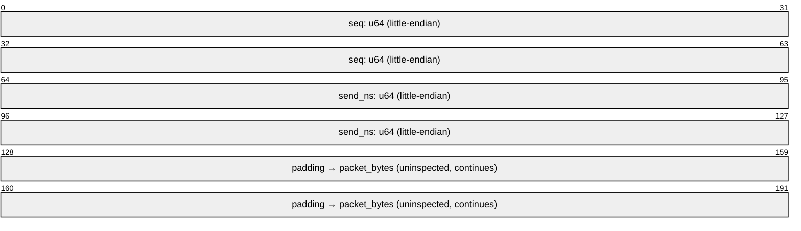

# andri — UDP Mode (throughput, loss, jitter)

**Author:** [mavyfaby](https://github.com/mavyfaby) &lt;maverickfabroa@gmail.com&gt;

> Detailed design for the UDP measurement mode. See [DESIGN.md](../DESIGN.md) for the
> overview and master [References](../DESIGN.md#references); session setup is in
> [docs/protocol.md](protocol.md). Status: **draft**.

The key words **MUST**, **SHOULD**, **MAY** are interpreted per
[RFC 2119](https://www.rfc-editor.org/info/rfc2119) /
[RFC 8174](https://www.rfc-editor.org/info/rfc8174).

UDP mode measures three things over a `UdpSocket`
([RFC 768](https://www.rfc-editor.org/info/rfc768)): **throughput**, one-way **packet
loss**, and **jitter** (interarrival delay variation). This is the only mode that
requires the client binary — browsers cannot open raw UDP (see [docs/web.md](web.md) §2).

## Why UDP needs a target rate (`--bitrate`)

Unlike TCP, **UDP mode requires you to choose a send rate** — and that is by design, not
a limitation. The two modes answer different questions:

| Question | Mode |
|---|---|
| "How fast *can* this link go?" | **TCP** — uncapped; it discovers the ceiling |
| "At *this* offered load, how much arrives and how clean is it?" | **UDP** — you set the load; it measures loss + jitter |

TCP has built-in congestion control: the sender ramps up, backs off on loss, and settles
at whatever the path sustains — so you just say "go" and it finds the maximum. **UDP has
no flow or congestion control whatsoever.** It transmits at exactly the rate the sender is
told to, full stop. There is no natural "max it out" behavior to discover, so a target
rate (`--bitrate`) is the *input variable of the experiment*, not a cap on UDP's ability.

This is what makes UDP mode useful: you set a rate that mimics real traffic and check
whether it survives the path —

```sh
andri --client <ip> --udp --bitrate 64K    # ~ a VoIP call
andri --client <ip> --udp --bitrate 5M     # ~ a video stream
andri --client <ip> --udp --bitrate 1G     # saturate a gigabit LAN (default)
andri --client <ip> --udp --bitrate 10G    # stress a 10G link
```

"How much loss?" is only meaningful paired with "at what rate?". To find a link's clean
UDP capacity, sweep `--bitrate` upward until loss starts climbing. Sending "as fast as
possible" (no target) would just flood the link to ~100% loss above capacity — useless and
antisocial — which is why iperf3's UDP mode likewise requires a `-b` rate.

## 1. Roles

- **Sender** — paces datagrams at the negotiated `bitrate_bps` for `duration + warmup`.
- **Receiver** — counts bytes, detects loss from sequence gaps, and computes jitter per
  RFC 3550. The receiver owns the authoritative loss/jitter numbers; the sender reports
  only what it sent.

Direction follows the session: by default the client sends and the server receives;
`bidir` runs both directions simultaneously, each with its own socket and counters.

## 2. Datagram layout

Every datagram begins with a fixed 16-byte header, **little-endian**, followed by
arbitrary padding to reach `packet_bytes`:

| Offset | Size | Field | Notes |
|---|---|---|---|
| 0 | 8 | `seq` (u64) | monotonic sequence, starts at 0 |
| 8 | 8 | `send_ns` (u64) | sender's monotonic clock, nanoseconds |
| 16 | … | padding | fill to `packet_bytes` (uninspected) |



- **Little-endian** here is deliberate and independent of the big-endian *control*
  framing in [protocol.md](protocol.md) §2 — the data path optimizes for the common
  little-endian host, the control path for network-order convention. Each doc states its
  own byte order; they do not need to match.
- `send_ns` is `Instant`-derived (monotonic), **not** wall-clock — see §5. It is the
  *sender's* clock; the receiver never assumes the two clocks are synchronized (the
  jitter math is designed around that, §4).
- `packet_bytes` defaults to a value that avoids IP fragmentation on a 1500-byte-MTU LAN
  (payload ≈ 1472 after IP+UDP headers); configurable up to the 65507 UDP max
  ([protocol.md](protocol.md) §5).

## 3. Sender pacing

The sender **MUST NOT** busy-spin. It paces using a `tokio::time::interval`, sending a
small burst each tick, per the UDP rate-limiting spirit of
[RFC 8085](https://www.rfc-editor.org/info/rfc8085):

```
ticks_per_sec    = e.g. 1000  (1 ms interval)
bits_per_packet  = packet_bytes * 8
packets_per_sec  = bitrate_bps / bits_per_packet
packets_per_tick = packets_per_sec / ticks_per_sec
```

- `packets_per_tick` is fractional; the sender carries the remainder forward so the
  *average* rate matches `bitrate_bps` without rounding drift (accumulate fractional
  packets, emit `floor`, keep the remainder).
- Burst size per tick **SHOULD** stay small (single-digit packets at 1 ms ticks for
  typical LAN rates) to avoid micro-bursts that inflate measured loss/jitter.
- The send loop reuses one buffer; only `seq` and `send_ns` are rewritten per packet (no
  per-packet allocation), consistent with the TCP hot-loop rule.
- Warm-up packets are sent but flagged out of the measurement window by sequence range
  (the receiver excludes `seq < warmup_count`).

## 4. Receiver: loss and jitter

### 4.1 Loss (RFC 7680 one-way loss)

The receiver tracks the highest sequence seen and a count of received packets. After the
window closes:

```
expected = (max_seq_in_window - min_seq_in_window) + 1
received = count of in-window packets actually received
lost     = expected - received
loss_ratio = lost / expected
```

This realizes the one-way packet loss metric of
[RFC 7680](https://www.rfc-editor.org/info/rfc7680) (IPPM, obsoletes RFC 2680), within the
[RFC 2330](https://www.rfc-editor.org/info/rfc2330) framework.

- **Duplicates** (same `seq` seen twice) are counted separately and **MUST NOT** reduce
  `lost` below zero; report `duplicates` alongside `lost`.
- **Reordering** is not loss: a late packet still within the window counts as received.
  The window boundary uses sequence numbers, not arrival order.
- Packets arriving after the window/grace closes are dropped from the count (reported as
  loss) — a deliberate, documented boundary effect.

### 4.2 Jitter (RFC 3550 §6.4.1)

Interarrival jitter uses the estimator from
[RFC 3550](https://www.rfc-editor.org/info/rfc3550) §6.4.1 — **the one algorithm andri
implements exactly.** For consecutive received packets *i-1* and *i*:

```
D(i-1, i) = (R_i - R_{i-1}) - (S_i - S_{i-1})
J_i       = J_{i-1} + (|D(i-1, i)| - J_{i-1}) / 16
```

where `S` is the sender timestamp (`send_ns`) and `R` is the receiver's arrival time
(its own `Instant`). The reported `jitter_ms` is the final `J`, converted to
milliseconds.

- **Clock-offset cancels.** Because `D` is a *difference of differences*, any fixed offset
  between the two unsynchronized monotonic clocks drops out — this is exactly why RFC 3550
  works without clock sync and why we do not need NTP.
- **Clock-rate skew does not fully cancel** and is a documented limitation; on a LAN over
  10 s it is negligible.
- The `1/16` gain is the RFC 3550 constant; we do not tune it, to stay conformant.
- For context on alternative IP-layer delay-variation formulations see
  [RFC 3393](https://www.rfc-editor.org/info/rfc3393) and the applicability guidance in
  [RFC 5481](https://www.rfc-editor.org/info/rfc5481); andri uses the RFC 3550 estimator
  specifically because it is the de-facto standard for this kind of tool and needs no
  clock sync.

## 5. Timing

- All timestamps are monotonic (`std::time::Instant`), never `SystemTime` — the same rule
  as every other mode.
- Throughput is computed from in-window received bytes ÷ in-window duration, reported in
  both bits/s and bytes/s ([protocol.md](protocol.md) §3.6).

## 6. Edge cases & decisions

- **Receiver socket buffer (`SO_RCVBUF`).** UDP has no flow control, so a sender pacing
  faster than the receiver drains will overflow the kernel's per-socket receive buffer,
  and the OS **silently drops** the overflow. That shows up in andri's result as packet
  loss even though the network delivered the datagrams — the loss is real-but-local.
  This is especially visible at high rates and on loopback (e.g. ~7% loss at 1 Gbit/s
  with default buffers, purely from buffer pressure, no network involved).

  **andri does not raise `SO_RCVBUF` itself.** Setting it requires a raw `setsockopt`
  syscall, which in Rust means `unsafe` FFI (directly, or via `libc`/`socket2`); andri's
  v1 deliberately uses **safe std only**, so it leaves the buffer at the OS default.
  To reduce buffer-overflow loss at high rates, raise the OS limit before testing:

  ```sh
  # Linux — raise the max, then the default applies up to it
  sudo sysctl -w net.core.rmem_max=33554432      # 32 MiB
  sudo sysctl -w net.core.rmem_default=33554432

  # macOS
  sudo sysctl -w kern.ipc.maxsockbuf=33554432
  ```

  Treat any UDP loss reported on a quiet LAN at a rate well below link capacity as
  *likely buffer-related*, not a network fault. Setting `SO_RCVBUF` in-process (and
  distinguishing kernel-drop loss from network loss via socket stats / `recvmmsg`) is a
  v2 enhancement — it is the point at which adding a `socket2`/`libc` dependency for the
  `unsafe` syscall becomes justified.
- **First packet** has no predecessor, so it seeds `J = 0` and is excluded from the first
  `D` computation.
- **Very low bitrates** (sub-`packets_per_tick` < 1) still work via the fractional-packet
  accumulator (§3); the sender may skip ticks entirely.
- **MTU/fragmentation**: andri does not set DF or do path-MTU discovery in v1; oversized
  `packet_bytes` that fragment are allowed but flagged in docs as measuring fragmented
  behavior, not raw datagram behavior.

## 7. Decisions & deferrals

**v1 (decided):**
- **Default `packet_bytes` = 1472** (1500 MTU − 20 IP − 8 UDP) to avoid fragmentation on
  a standard Ethernet LAN.
- **Per-second time series is captured** (throughput, loss, jitter) and returned in
  `Result.samples[]` ([protocol.md](protocol.md) §3.6), alongside the summary.

**Deferred to v2:**
- Setting the DF bit and reporting path-MTU effects.
- Distinguishing network loss from local kernel-buffer (`SO_RCVBUF`) drops in the report.

## References

See the master list in [DESIGN.md](../DESIGN.md#references). The ones load-bearing for this
mode:

- **[RFC 768](https://www.rfc-editor.org/info/rfc768)** — User Datagram Protocol. *The
  transport.*
- **[RFC 8085](https://www.rfc-editor.org/info/rfc8085)** — UDP Usage Guidelines. *Sender
  pacing.*
- **[RFC 3550](https://www.rfc-editor.org/info/rfc3550)** §6.4.1 — RTP interarrival jitter.
  **Implemented exactly.**
- **[RFC 7680](https://www.rfc-editor.org/info/rfc7680)** — One-Way Loss Metric (IPPM).
  *Loss definition.*
- **[RFC 2330](https://www.rfc-editor.org/info/rfc2330)** — IP Performance Metrics
  framework. *Context.*
- **[RFC 3393](https://www.rfc-editor.org/info/rfc3393)** / **[RFC 5481](https://www.rfc-editor.org/info/rfc5481)**
  — IP delay variation metric & applicability. *Informs the jitter choice.*
